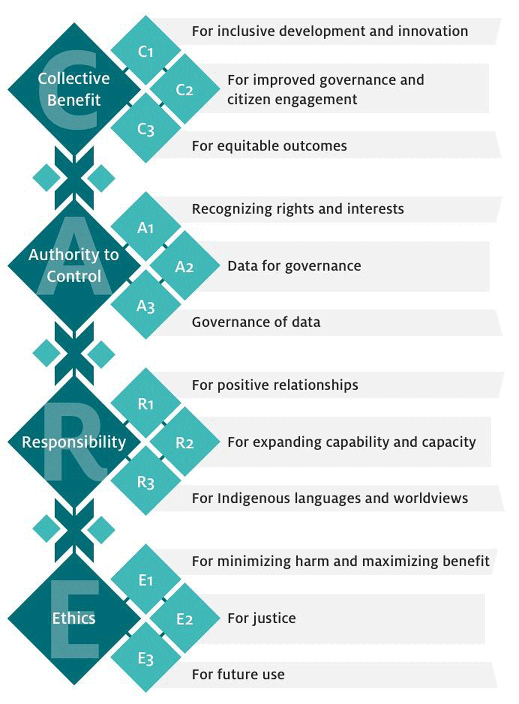
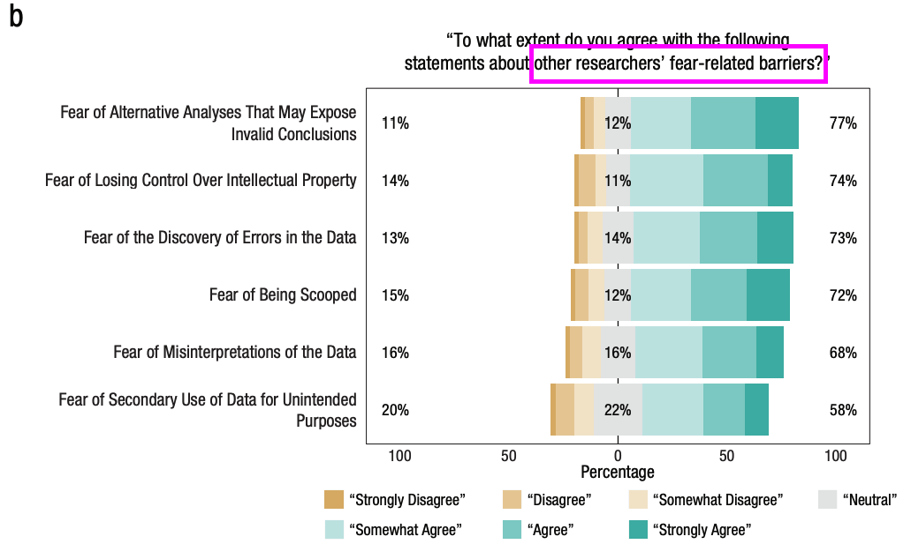
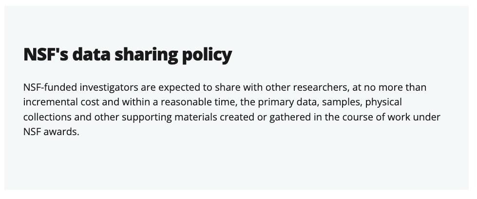
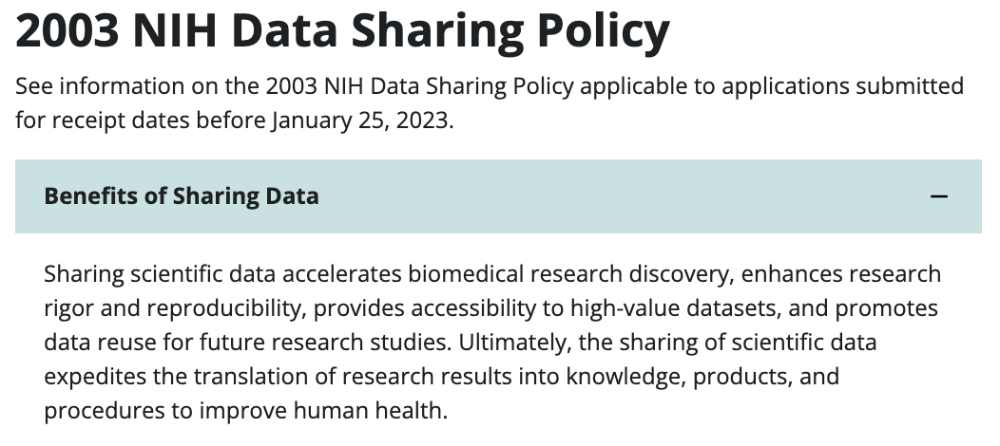
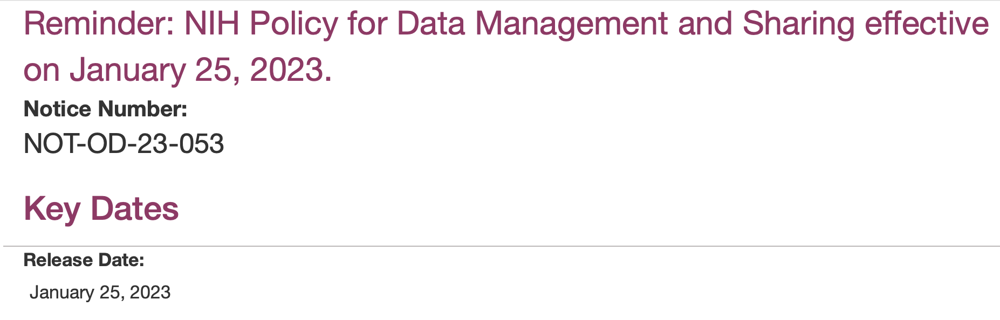
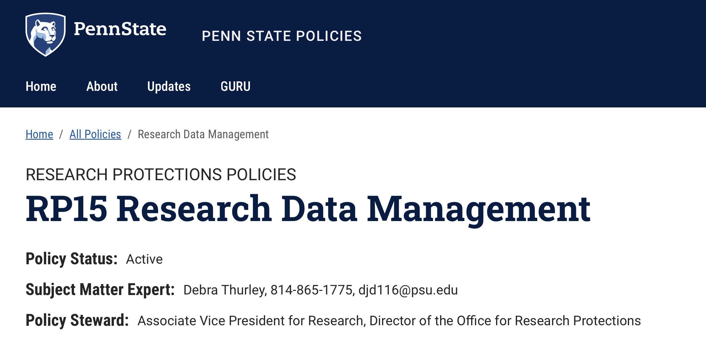
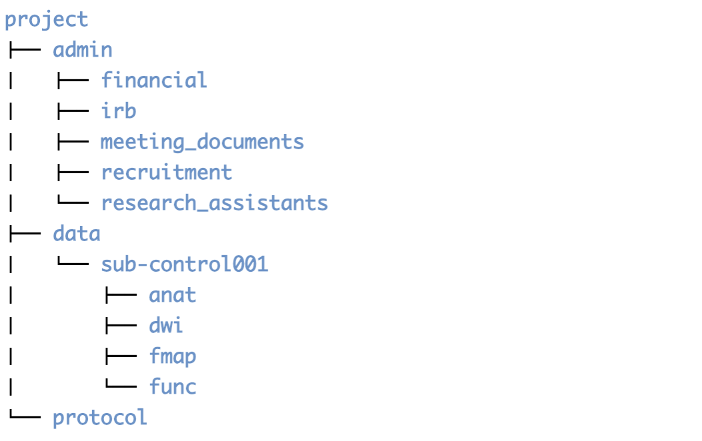
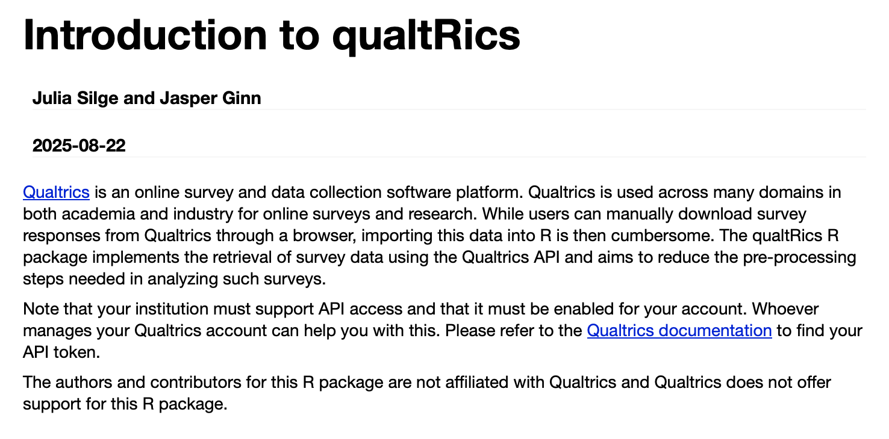
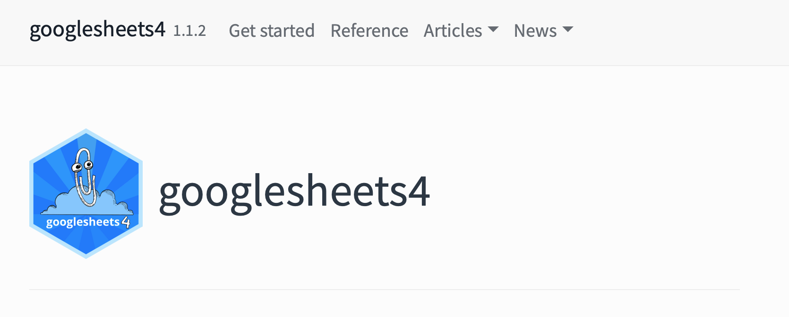
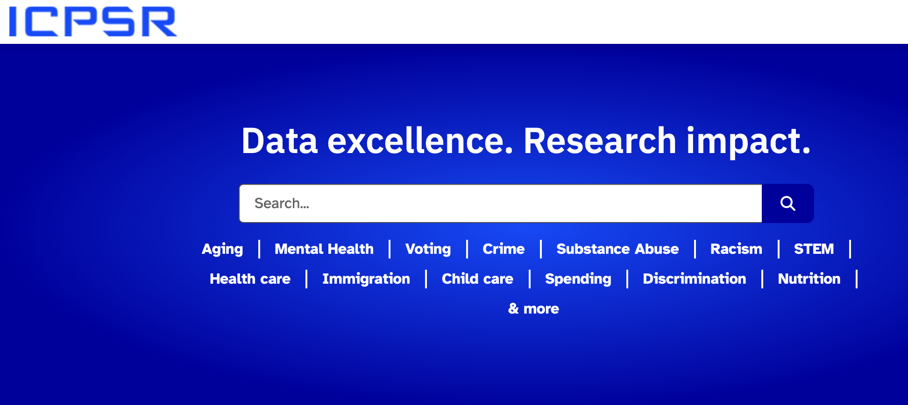

# Prelude

---



-- @NYU_Health_Sciences_Library2013-gp

---

```{r}
#| label: fig-sleic-talk-qr
#| fig-cap: "<https://penn-state-open-science.github.io/sleic-best-practices-2025-12-02/>"
plot(qrcode::qr_code("https://penn-state-open-science.github.io/sleic-best-practices-2025-12-02/"))
```

## Agenda

- Our hidden one
- How
- Where

---

:::: {.columns}
::: {.column width=50%}
{width="70%" fig-align="center"}
:::
::: {.column width=50%}
{width="70%" fig-align="center"}
:::
::::

# Our hidden agenda

## 


## Best practices in

::: {.incremental}
- Project management
- $+$ Data management 
- $\rightarrow$ Sharing
:::

## Sharing...

::: {.incremental}
- Accelerates discovery
- Bolsters credibility
:::

## An ethical thing to do

>Whereas regulators of human subjects research often view data sharing solely in terms of potential risks to subjects, we argue that the **principles of human subject research require an analysis of both risks and benefits**...

-- @Brakewood2013-wj

## 

>...such an analysis suggests that **researchers may have a positive duty to share data** in order to maximize the contribution that individual participants have made.

-- @Brakewood2013-wj

<!-- ## Ethical data sharing -->

<!-- :::: {.columns} -->
<!-- ::: {.column width=50%} -->
<!-- - **F**indable -->
<!-- - **A**ccessible -->
<!-- - **I**nteroperable -->
<!-- - **R**eusable -->

<!-- -- @Wilkinson2016-qr -->
<!-- ::: -->
<!-- ::: {.column width=50%} -->
<!--  -->
<!-- ::: -->
<!-- :::: -->


## {auto-animate=true}


## {auto-animate=true}

{width="150%"}

## {auto-animate=true}

:::: {.columns}
::: {.column width=60%}

:::
::: {.column width=40%}
::: {.fragment}
- Must publish first
- No time, funding
- No permission
- Not required
- No place to put
- Insufficient skills
:::
:::
::::

---


---

{fig-align="center"}

## {auto-animate=true}


## {auto-animate=true}

:::: {.columns}
::: {.column width=60%}

:::
::: {.column width=40%}
::: {.fragment}
- Misinterpretations of the data
- Scooped
- Control over IP
- Unintended secondary use
- Invalid conclusions, errors
:::
:::
::::

## {auto-animate=true}



## {auto-animate=true}

:::: {.columns}
::: {.column width=60%}

:::
::: {.column width=40%}
::: {.fragment}
- Invalid conclusions
- Control over IP
- Errors
- Misinterpretation
:::
:::
::::

## Moving the needle {auto-animate=true auto-animate-easing="ease-in-out"}


## {auto-animate=true auto-animate-easing="ease-in-out"}

:::: {.columns}
::: {.column width=60%}

:::
::: {.column width=40%}
::: {.fragment}
- Required by funder, journal, institution
- Encouraged by funder, journal, institution
- Easy, shown how
- Garner citations, recognition, bigger/more grants
:::
:::
::::

## Funders think you should



---



## NIH Data Management and Sharing Plan (DMS)

> to promote the management and sharing of scientific data generated from NIH-funded or conducted research.

-- @National-Institutes-of-HealthUnknown-ys

## NIH Data Management and Sharing Plan (DMS)



## NIH Data Management and Sharing Plan (DMS)

- 2p DMS plan **required**
- Must justify reasons if not sharing
- Sharing plans become formal part of award agreement

---



---

:::: {.columns}
::: {.column width=60%}

:::
::: {.column width=40%}
- *Required by funder*, journal, institution
- *Encouraged by funder*, *journal*, *institution*

::: {.incremental}
- **Easy, shown how**
- **Garner citations, recognition, bigger/more grants**
:::
:::
::::

# How

---


---


---


## Pay me now, or pay me later



-- @PathfindersPerform2013-cy

## Principles

- Plan your work, work your plan
- "Good enough" practices
- Document
- Automate
- Get credit

## Plan your work

```{mermaid}
%%| label: fig-proposal-to-project
%%| fig-cap: "From proposal to project"
flowchart LR
  A(["Idea"]) --> B["Proposal"]
  B --> C("Project_1")
  B --> D("Project_2")
  D --> E("Paper_2")
  C --> F("Paper_1")
  E --> G("Fame & Glory")
  F --> G
```

---

```{mermaid}
%%| label: fig-proposal-to-project-realistic
%%| fig-cap: "From proposal to project: More realistic"
flowchart LR
  A(["Idea"]) --> B["Proposal"]
  B --> C("Project_1")
  B --> D("Project_2")
  B --> I("IRB protocol")
  G(["Data mgmt plan"]) --> B
  G <--> I
  C --> I
  D --> I
  D --> E("Paper_2")
  C --> F("Paper_1")
```

---

```{mermaid}
%%| label: fig-one-project
%%| fig-cap: "One project workflow"
flowchart LR
  A["Project_1"] --> B["Survey"]
  A --> C["fMRI"]
  A --> D["Task_1"]
  A --> E["Task_2"]
  B --> P["Data_pipeline_1"]
  C --> Q["Data_pipeline_2"]
  D --> R["Data_pipeline_3"]
  E --> R
  F["Data mgmt plan"] --- B & C & D & E & P & Q & R
  P --> G["Analysis_1"]
  Q & R --> H["Analysis_2"]
  G & H --> I["Poster"]
  G & H --> J["Paper"]
```

---

```{mermaid}
%%| label: fig-one-project-w-sharing
%%| fig-cap: "Planned data sharing to a repository"
flowchart TD
  A["Project_1"] --> B["Survey"]
  A --> C["fMRI"]
  A --> D["Task_1"]
  A --> E["Task_2"]
  B --> P["Data_pipeline_1"]
  C --> Q["Data_pipeline_2"]
  D --> R["Data_pipeline_3"]
  E --> R
  F["Data mgmt plan"] --- B & C & D & E & P & Q & R
  P --> G["Analysis_1"]
  Q & R --> H["Analysis_2"]
  G & H --> I["Poster"]
  G & H --> J["Paper"]
  C & D & G & H & F --> K["Data repository"]
```

---

```{mermaid}
%%| label: fig-one-project-w-sharing-multirepo
%%| fig-cap: "Planned data sharing in multiple repositories"
flowchart LR
  A["Project_1"] --> B["Survey"]
  A --> C["fMRI"]
  A --> D["Task_1"]
  A --> E["Task_2"]
  B --> P["Data_pipeline_1"]
  C --> Q["Data_pipeline_2"]
  D --> R["Data_pipeline_3"]
  E --> R
  F["Data mgmt plan"] --- B & C & D & E & P & Q & R
  P --> G["Analysis_1"]
  Q & R --> H["Analysis_2"]
  G & H --> I["Poster"]
  G & H --> J["Paper"]
  B & C & D & G & H & F --> K["OpenNeuro"]
  B --> L["OSF"]
  K --- L
```

---

::: {.callout-important}
## Lesson learned

Plan your workflow in as much detail as you possibly can before you start.

:::

::: {.fragment}
::: {.callout-important}
## Lesson learned

Plans change.

So, evaluate, revise, and update.

Document what you changed, when, and why.

:::
:::

## Lessons learned

::: {.callout-note}
## Recommended practice

Version your protocol.

*Manual is fine*: e.g, `nsf-2412345-protocol-2025-12-02v01.docx`.

*Automated is better*: 

Google Docs keeps version histories. 

[Quarto](https://quarto.org) enables git-versioned web sites as protocols.
:::

## Examples

::: {.incremental}
- Open Scholarship Survey (2022-23)
  - [IRB protocol](https://penn-state-open-science.github.io/survey-fall-2022/hrp-591.html) + [data processing](https://penn-state-open-science.github.io/survey-fall-2022/data-gathering-and-cleaning.html) and [visualization pipeline](https://penn-state-open-science.github.io/survey-fall-2022/data-visualization.html)
- Play & Learning Across a Year (PLAY Project)
  - Project [site](https://play-project.org) and [protocol](https://play-project.org/collection.html)
  - Survey [data cleaning and visualization](https://play-project.org/KoBoToolbox)

:::


---


  
---

:::: {.columns}
::: {.column width=50%}

:::
::: {.column width=50%}

:::
::::

---


---



-- @UnknownUnknown-vx

---



-- @UnknownUnknown-ik

---

:::: {.columns}
::: {.column width=50%}

:::
::: {.column width=50%}



:::
::::

-- @Gilmore2015-oj

---

::: {.callout-important}
## Lesson learned

Documented plans & practices can be reused for new projects.

Be kind to your future (forgetful) self.

:::

---

## Good Enough Practices (Alaina)

{width="70%" fig-align="center"}

<!-- ## Automate -->

<!-- - Script/code *everything* you possibly can -->
<!--   - Learn R, Python, shell scripting -->
<!--   - You can do it! -->
<!--   - Build things you actually need -->
  
## Automate

```bash
# These are bash shell commands
mkdir -p project/{admin,protocol,data}
mkdir -p project/admin/{financial,irb,meeting_documents,recruitment,research_assistants}
mkdir -p project/data/sub-control01/{anat,func,dwi,fmap}
```

## Automate



## Automate

- Capture data in electronic form as much as possible
  - e.g., Qualtrics, Google Forms, REDCap, [KoBoToolbox](https://kobotoolbox.org)
- Let the computer do tedious, repetitive, error-prone work
  - e.g., data export & cleaning
  - Code as documentation
  
##

:::: {.columns}
::: {.column width=50%}

:::
::: {.column width=50%}

:::
::::

## Automate

:::: {.columns}
::: {.column width=30%}
{width="70%"}
:::
::: {.column width=70%}
- Project-specific R packages
- Using [REDcap](https://project-redcap.org) to capture project metadata
:::
::::

## Automate

:::: {.columns}
::: {.column width=30%}
{width="70%"}
:::
::: {.column width=70%}
- Executable [Quarto](https://quarto.org) documents
  - Bootcamp 2025 [site](https://penn-state-open-science.github.io/bootcamp-2025/)
  - Bootcamp 2025 Workshops [I](https://penn-state-open-science.github.io/bootcamp-2025-quarto-I/) and [II](https://penn-state-open-science.github.io/bootcamp-2025-quarto-II/)
  - Open Scholarship [Survey](https://penn-state-open-science.github.io/survey-fall-2022/)
:::
::::

## Common themes

- Raw data live in secure place
- Use API calls to gather, clean, process

::: {.fragment}
::: {.callout-important}
## (Painful) lesson learned

APIs can change, so be prepared to update your procedures & code.

:::
:::

# Where

## Big picture

- Privacy & permission
- Type(s) of data
- Repositories
- Data papers

## Privacy & permission

- Ask your participants
- Broad consent vs. narrow
- Store sharing permission & consider sharing it
- Pseudo-anonymizing
  - May or may not be required

## Type(s) of data

- Imaging data
- Non-identifiable
- Identifiable

## Imaging data 

:::: {.columns}
::: {.column width=40%}
- [OpenNeuro](https://openneuro.org)
- Use [BIDS](https://bids.neuroimaging.io)
:::
::: {.column width=60%}

:::
::::

## Imaging data

:::: {.columns}
::: {.column width=40%}
- Use [BIDS](https://bids.neuroimaging.io)
:::
::: {.column width=60%}

:::
::::

## Non-identifiable data

:::: {.columns}
::: {.column width=40%}
- [Level 1](https://security.psu.edu/awareness/icdt/) in Penn State's data classification
- PSU's [ScholarSphere](https://scholarsphere.psu.edu)
:::
::: {.column width=60%}

:::
::::

## Non-identifable data

:::: {.columns}
::: {.column width=40%}
- [Open Science Framework (OSF)](https://osf.io)
:::
::: {.column width=60%}

:::
::::
  
## Identifiable data

:::: {.columns}
::: {.column width=50%}
- Especially video & audio
- Can be shared *unaltered*
:::
::: {.column width=50%}

:::
::::

## Sharing identifiable data

:::: {.columns}
::: {.column width=40%}
- [Databrary](https://databrary.org)
- Among institutionally authorized researchers
- With explicit participant permission
:::
::: {.column width=60%}

:::
::::

## Sharing identifiable data

:::: {.columns}
::: {.column width=50%}
- [Inter-university Consortium for Political and Social Research (ICPSR)](https://www.icpsr.umich.edu/sites/icpsr/home)
:::
::: {.column width=50%}

:::
::::

## Learn more

- [Open Scholarship Initiative](https://penn-state-open-science.github.io)
- Open Scholarship Bootcamp [2025](https://penn-state-open-science.github.io/bootcamp-2025/), [2023](https://penn-state-open-science.github.io/bootcamp-2023/)
- Data management workshops [2025](https://penn-state-open-science.github.io/data-mgmt-2025/), [2024](https://penn-state-open-science.github.io/data-mgmt-2024/)
- Data paper [workshop](https://penn-state-open-science.github.io/bootcamp-2025/sessions.html#getting-credit-for-sharing-your-data-part-iii-data-papers) from 2025 Bootcamp

# Wrap-up

## Take-homes

- Why
  - Sharing data maximizes benefits to participants, accelerates discovery
  - Sharing data required by funders
  
## Take-homes

- How
  - Plan your work, work your plan
  - Automate
  - Make documentation a practice
  
## Take-homes

- Where
  - Imaging data
  - Identifiable vs. non-identifiable
  
# Resources

## About

This talk was produced using [Quarto](https://quarto.org), using the [RStudio](https://posit.co/products/open-source/rstudio/)
Integrated Development Environment (IDE), version `r Sys.getenv("RSTUDIO_VER")`.

The source files are in R and R Markdown, then rendered to HTML using the
[revealJS](https://revealjs.com) framework. 
The HTML slides are hosted in a [GitHub repo](https://github.com/penn-state-open-science/sleic-best-practices-2025-12-01) and served by GitHub pages: 
<https://penn-state-open-science.github.io/sleic-best-practices-2025-12-01/>

## References
